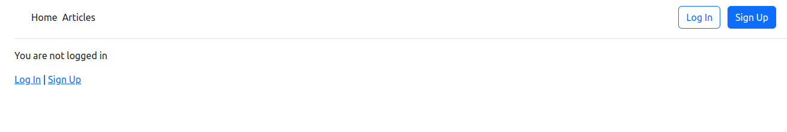

# django-newspaper

## Description
Newspaper app from the book Django for Beginners by William S. Vincent

- Type: Full-stack web development
- Source: https://www.goodreads.com/book/show/41108453-django-for-beginners
- Date: September/2022

## How to run
- pythin -m pip install requirements.txt
- python manage.py runserver
- open the suggested link

Technologies used:
- Python Django
- bootstrap

## What was done:
- User authentication, Custom user model
- password workaround
- CRUD operations for articles 
- permission and authorization
- comments for articles
- bootstrap styling

## Status
- possible to sign in, log in, change/reset passwords
- add new article, read, edit and delete existing articles
- adding comments (bug at the moment), seeing existing comments
- all standard operations from admin

## App screens:
- home page
- 
- signup page
- 
- articles view
- 
- article detail with comments
- 
